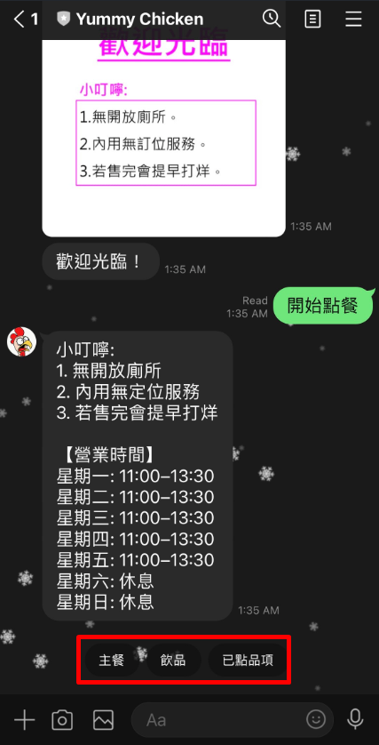
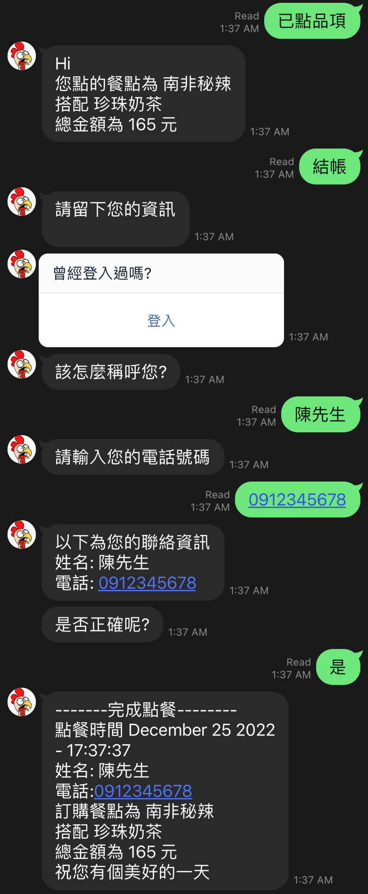
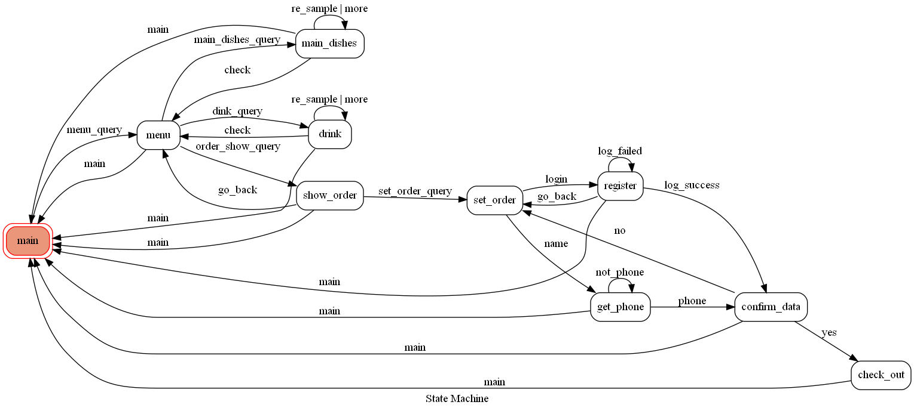

# ORDER FOOD CHAT-BOT
This is the chat bot for one of the resturant near NCKU.(雙城烤雞飯)


### Prerequisite
* Python 3.8
* HTTPS Server

#### How to start
1. Make an .env file at the base directory were you put your enviroment variables an LINE_CHANNEL_ACCESS_TOKEN, and LINE_CHANNEL_SECRET.
2. Install all the requirements
```
$ pip install -r requirements.txt
```
3. Download and use ngrok to map to tunnel to port 8000
```
$ ngrok http 8000
```
4. Run "app.py"
```
$ python app.py
```

# Features 
Navigation menus built with carousels and buttons for easier navigation

### 3 Main Features!
- Browse menu (dishes, drinks)
- Give an order
- History for customer

{:width="300px"}
{:width="300px"}


## FSM Graph
The Finite State Machine graph looks as it follows:


